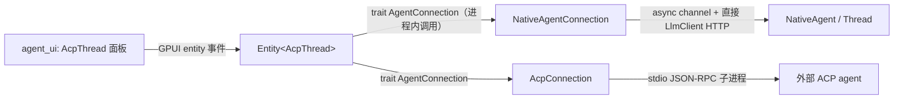

# Zed 内置 Agent 的通信机制：原生 in-process vs ACP

> 分析日期 2026-10-07，基于上游 `~/repos/ide_ls/learn_ls/zed` 当前 checkout。
> 问题：内置 Zed Agent 是通过 ACP 协议通信，还是自己实现的通信？

## 结论

**内置 agent（`NativeAgent`）是纯原生的进程内实现，不走 ACP 协议通信。**
ACP（JSON-RPC over stdio）只用于外部 agent 子进程（`agent_servers::acp::AcpConnection`）。

容易混淆的点：Zed 把 ACP 的**数据模型类型**（`agent_client_protocol::schema`，
如 `SessionId`、消息内容块）当成 UI 与 agent 之间的统一类型，并让内置 agent 实现一个
**进程内的 Rust trait** `acp_thread::AgentConnection`（定义在
`crates/acp_thread/src/connection.rs` L91，不是协议）。所以"处处是 ACP"，
但真走 ACP 协议（序列化 + 子进程 + stdio）的只有外部 agent 那条路。

## 证据

### 1. 内置 agent：GPUI 实体 + async channel，直接打 LLM

`crates/agent/src/agent.rs`：

- `pub struct NativeAgent` —— GPUI entity（L440）
- `pub struct NativeAgentConnection(pub Entity<NativeAgent>)`（L2195）
- `impl acp_thread::AgentConnection for NativeAgentConnection`（L2774）
- `pub static ZED_AGENT_ID: LazyLock<AgentId> = LazyLock::new(|| AgentId::new("Zed Agent"))`（L2742）

turn 的驱动方式（agent.rs L2021 / L2064 / L2177 / L2274）：

```rust
let response_stream = thread.update(cx, |thread, cx| { ... thread.send_existing(cx) ... });
NativeAgentConnection::handle_thread_events(response_stream, acp_thread, Some(self.clone()), cx)
```

即 `Thread` 返回一个 `response_stream`（async channel），`handle_thread_events`
把事件泵进 `AcpThread` entity，agent_ui 面板订阅 `AcpThread` 的事件渲染。

`crates/agent/src/thread.rs`：

- 模型调用走 `LanguageModelRegistry` / `LanguageModel` / `LlmClient`
  （HTTP streaming 直连 OpenAI/Anthropic/Ollama 等 provider）
- 工具（`edit_file`、`terminal`、`create_directory` 等）都是
  `crates/agent/src/tools/` 里的**进程内 Rust 实现**，无序列化/IPC 边界

### 2. 外部 agent：真 ACP

`crates/agent_servers/src/acp.rs`：

- `pub struct AcpConnection`（L267）持有 `child: Option<Child>`（子进程）
  + `transport::StdioProcess`（L690），跑 `agent-client-protocol` 的
  JSON-RPC 2.0 帧（测试中直接拼 `"jsonrpc": "2.0"` 消息，L3731+）
- `impl AgentConnection for AcpConnection`（L1537）

只有当 agent profile 指向外部可执行文件（Claude Code、`ant` 等 ACP agent）时才走这条链路。

### 3. 数据流总览



即：ACP schema 类型做**统一数据模型**，UI 对内置/外部 agent 一视同仁；
通信介质完全不同——内置是内存引用 + channel，外部才是协议。

## 对我们 fork（AAgent）的含义

- 我们保留同样结构：`packages/acp_thread` 依赖 `agent-client-protocol`
  （只做 schema 类型），但 `AgentConnection` trait 本身是进程内的
- 要做自己的"内置 agent"，实现 `acp_thread::AgentConnection` 即可挂进现有面板，
  **不需要**把 LLM 调用包进 ACP JSON-RPC 子进程
- `packages/agent_servers` 里的 `AcpConnection` 才是外部 agent 入口；
  排查"内置 agent 不工作"时应先看 GPUI 事件链（`AcpThread` 面板 ↔
  `NativeAgentConnection::handle_thread_events`），而不是去找协议层
